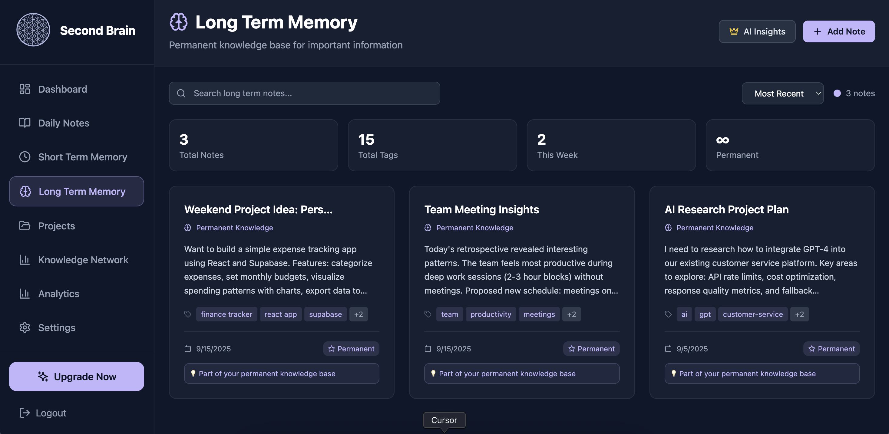

# Second Brain - AI-Powered Knowledge Management

Transform scattered thoughts into connected knowledge with our intelligent note-taking system that grows smarter with every entry. Built for polymaths who want to turn their ideas into powerful, interconnected knowledge.

## ✨ Core Features

### 📝 **Intelligent Note Management**
- **Daily Notes**: Capture daily thoughts and reflections with automatic linking
- **Short-term Memory**: 30-day evaluation period with auto-archiving
- **Long-term Memory**: Permanent knowledge base for important insights
- **Voice Recording**: Instant voice-to-text transcription and note creation
- **AI-Powered Tagging**: Automatic categorization with intelligent suggestions

### 🔗 **Knowledge Discovery**
- **Interactive Knowledge Graph**: Visualize relationships between your ideas
- **Connection Discovery**: AI automatically finds hidden relationships
- **Pattern Recognition**: Discover trends and insights across your notes
- **Smart Diagrams**: Generate Mermaid diagrams from your notes

### 📊 **Analytics & Insights**
- **Analytics Dashboard**: Track your knowledge growth and productivity
- **Daily Insights**: AI-powered analysis of your short-term notes
- **Deep AI Analysis**: Advanced insights for your permanent knowledge base
- **Learning Patterns**: Understand how your thinking evolves

### 🎯 **Project Organization**
- **Project Management**: Organize knowledge by domains and topics
- **Task Management**: Break down complex ideas into actionable tasks
- **Progress Tracking**: Visual indicators for project completion
- **Kanban Boards**: Drag-and-drop task organization

### 💎 **Pro Features**
- **Connection Discovery**: AI finds hidden relationships between ideas
- **Pattern Recognition & Trends**: Advanced analytics with AI insights
- **Daily Insights**: Personalized recommendations for short-term notes
- **Deep AI Analysis**: Comprehensive analysis of your knowledge base
- **Mermaid Diagram Generation**: Visualize complex ideas and processes
- **Offline Mode + Sync**: Work anywhere, sync everywhere
- **Theme Choices**: Customize your experience

## 💰 Pricing

### Free Plan - $0 forever
Perfect for capturing your first ideas:
- Daily notes & reflections
- Short-term memory (30-day auto-archive)
- Long-term memory storage
- Basic project management
- Voice recording & transcription
- AI-powered tagging system
- Interactive knowledge graph
- Limited mermaid diagram generation
- Analytics dashboard
- Export capabilities

### Pro Plan - $9 per month
For polymaths building their second brain:
- Everything in Free
- Connection discovery
- Pattern recognition & trends
- Daily insights for short-term notes
- Deep AI analysis of your permanent knowledge base
- Advanced analytics with AI-powered insights
- Mermaid diagram generation
- Offline mode + sync
- Feature request priority
- Theme choices

## 🔧 Built With

- **React** - Modern UI framework
- **TypeScript** - Type safety
- **Tailwind CSS** - Styling
- **Supabase** - Backend & Database
- **AI Integration** - Smart features

## 📄 License

**Commercial License - All Rights Reserved**

This software and its source code are proprietary and confidential. You may not use, copy, modify, distribute, or create derivative works of this software without explicit written permission from the copyright holder.

**Restrictions:**
- ❌ Commercial use is prohibited
- ❌ Distribution is prohibited  
- ❌ Modification is prohibited
- ❌ Private use is prohibited
- ❌ Sublicensing is prohibited

For licensing inquiries, please contact: productora.analytics@gmail.com

© 2025 Second Brain. All rights reserved.

## 🙏 Acknowledgments

- [Supabase](https://supabase.com) - Backend infrastructure
- [Tailwind CSS](https://tailwindcss.com) - Styling framework
- [Lucide](https://lucide.dev) - Beautiful icons
- [React](https://react.dev) - Frontend framework

## 📞 Support & Contact

- 📧 Email: productora.analytics@gmail.com
- 🐛 Issues: [GitHub Issues](https://github.com/yourusername/second-brain/issues)
- 💼 Business Inquiries: productora.analytics@gmail.com
- 🔒 Security Issues: productora.analytics@gmail.com

---

**Built with ❤️ by the Second Brain**