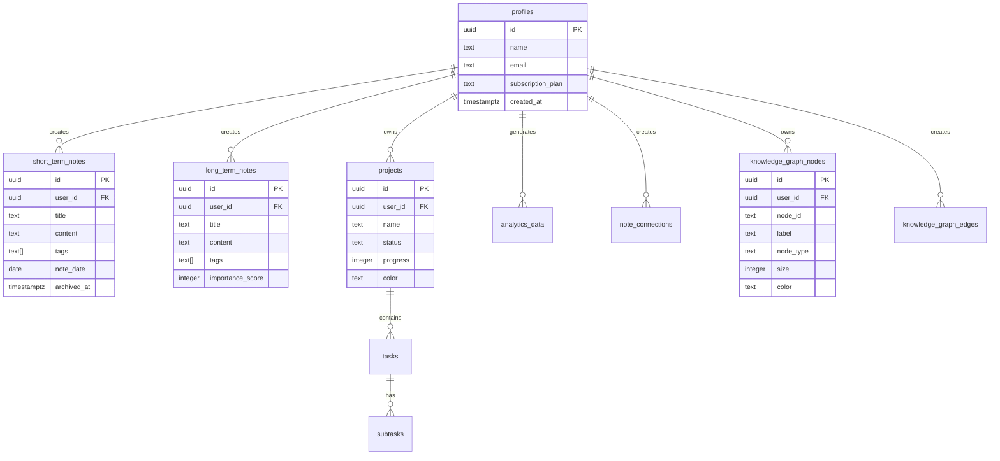

# 🧠 Second Brain - Knowledge Management System

A modern, AI-powered knowledge management application built with React, TypeScript, and Supabase. Transform scattered thoughts into connected knowledge with intelligent note-taking, analytics, and visualization.


## ✨ Features

### 🏠 **Landing & Authentication**
- Beautiful landing page with feature showcase
- Secure authentication with Supabase
- Demo mode for quick exploration

### 📝 **Note Management**
- **Daily Notes**: Capture daily thoughts and reflections
- **Short-term Memory**: Temporary notes (auto-archive after 30 days)
- **Long-term Memory**: Permanent knowledge base
- Rich text editing with formatting tools
- Tag-based organization system

### 📊 **Advanced Analytics**
- Interactive bubble charts for topic visualization
- Knowledge growth tracking over time
- Learning pattern analysis
- Word clouds and trend visualization
- AI-powered insights (Pro feature)

### 🎯 **Project Management**
- Knowledge domain organization
- Task and subtask management
- Progress tracking with visual indicators
- Kanban-style project boards

### 🔗 **Knowledge Graph**
- Interactive network visualization
- Semantic connections between notes
- Relationship strength indicators
- Filterable by type and date

### 💎 **Premium Features**
- AI-powered knowledge gap analysis
- Personalized learning recommendations
- Advanced pattern recognition
- Priority support

## 🏗️ Architecture


## 🗄️ Database Schema



## 🚀 Getting Started

### Prerequisites
- Node.js 18+ 
- npm or yarn
- Supabase account

### Installation

1. **Clone the repository**
```bash
git clone https://github.com/yourusername/second-brain.git
cd second-brain
```

2. **Install dependencies**
```bash
npm install
```

3. **Set up Supabase**
```bash
# Create a new Supabase project at https://supabase.com
# Copy your project URL and anon key
```

4. **Configure environment variables**
```bash
# Create .env file
VITE_SUPABASE_URL=your_supabase_url
VITE_SUPABASE_ANON_KEY=your_supabase_anon_key
```

5. **Run database migrations**
```bash
# Apply the migration file in supabase/migrations/
# This creates all necessary tables and policies
```

6. **Start development server**
```bash
npm run dev
```

## 🎨 Design System

### Color Palette
- **Primary**: `#C2B5FC` (Purple)
- **Secondary**: `#a7c7e7` (Light Blue)
- **Success**: `#b8e6b8` (Light Green)
- **Warning**: `#f4c2a1` (Light Orange)
- **Error**: `#e7a7c7` (Light Pink)
- **Background**: `#0f172a` (Slate 900)

### Typography
- **Headings**: Inter, 120% line height
- **Body**: Inter, 150% line height
- **Code**: JetBrains Mono

### Spacing
- **Base unit**: 8px
- **Component padding**: 16px, 24px
- **Section spacing**: 24px, 32px

## 🔧 Tech Stack

### Frontend
- **React 18** - UI framework
- **TypeScript** - Type safety
- **Tailwind CSS** - Styling
- **Lucide React** - Icons
- **Vite** - Build tool

### Backend
- **Supabase** - Backend as a Service
- **PostgreSQL** - Database
- **Row Level Security** - Data protection
- **Real-time subscriptions** - Live updates

### Analytics & Visualization
- **Custom SVG charts** - Performance optimized
- **Interactive knowledge graphs** - D3.js inspired
- **Responsive design** - Mobile-first approach

## 📱 User Flow


## 🔐 Security Features

- **Row Level Security (RLS)** - Database-level access control
- **JWT Authentication** - Secure token-based auth
- **Data Encryption** - At rest and in transit
- **CORS Protection** - Cross-origin request security
- **Input Validation** - XSS and injection prevention

## 📈 Performance Optimizations

- **Code Splitting** - Lazy loading of components
- **Image Optimization** - WebP format with fallbacks
- **Database Indexing** - Optimized query performance
- **Caching Strategy** - Browser and CDN caching
- **Bundle Analysis** - Tree shaking and minification

## 🧪 Testing Strategy

```bash
# Unit tests
npm run test

# E2E tests
npm run test:e2e

# Type checking
npm run type-check

# Linting
npm run lint
```

## 🚀 Deployment

### Netlify (Recommended)
```bash
# Build for production
npm run build

# Deploy to Netlify
npm run deploy
```

### Manual Deployment
```bash
# Build static files
npm run build

# Upload dist/ folder to your hosting provider
```

## 🤝 Contributing

1. Fork the repository
2. Create a feature branch (`git checkout -b feature/amazing-feature`)
3. Commit your changes (`git commit -m 'Add amazing feature'`)
4. Push to the branch (`git push origin feature/amazing-feature`)
5. Open a Pull Request

## 📄 License

This project is licensed under the MIT License - see the [LICENSE](LICENSE) file for details.

## 🙏 Acknowledgments

- [Supabase](https://supabase.com) - Backend infrastructure
- [Tailwind CSS](https://tailwindcss.com) - Styling framework
- [Lucide](https://lucide.dev) - Beautiful icons
- [Unsplash](https://unsplash.com) - Stock photography

## 📞 Support

- 📧 Email: support@secondbrain.app
- 💬 Discord: [Join our community](https://discord.gg/secondbrain)
- 📖 Docs: [Documentation](https://docs.secondbrain.app)
- 🐛 Issues: [GitHub Issues](https://github.com/yourusername/second-brain/issues)

---

**Built with ❤️ by the Second Brain team**